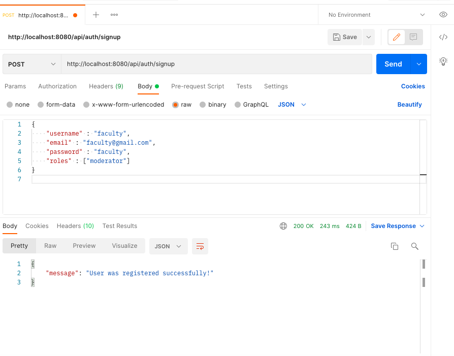
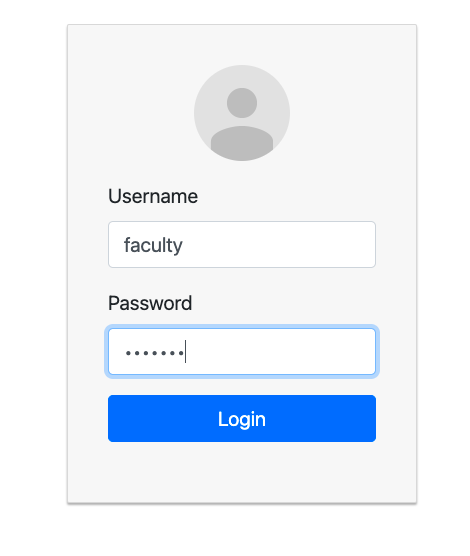

# Class Scheduler Web Application
### Video demo : Protype (Click the banner to view)

[](https://www.youtube.com/watch?v=fsUws3citjA)


The scheduler application consists of two major parts :

- Frontend : stored in folder named "Frontend"
- Backend : stored in folder named "Backend"
-- For connecting backend to the database make sure to run MongoDB as a service in your local machine.


## Tech

Scheduler uses a number of tech stack to work properly:

- [React](https://reactjs.org/) - A JavaScript library for building user interfaces
- [Bootstrap](https://getbootstrap.com/) - great UI boilerplate for modern web apps
- [node.js](node.js) - evented I/O for the backend
- [Express](http://expressjs.com) - fast node.js network app framework
- [JWT Auth](https://jwt.io/) - creating data with optional signature and/or optional encryption
- [MongoDB](https://www.mongodb.com/) - document-oriented, NoSQL database program

# Installation

Scheduler requires [Node.js](https://nodejs.org/) v14+ to run.

### Inside Frontend folder
##### Set port
.env
```
PORT=8081
```
##### Project setup

In the frontend directory, you can run:

```
npm install
# or
yarn install
```

or

##### Compiles and hot-reloads for development


```
npm start
# or
yarn start
```

Open [http://localhost:8081](http://localhost:8081) to view it in the browser.

### Inside Backend folder

##### Project setup
```
npm install
```

### Run
```
node server.js
```

## Database setup

When a new user signs up, he/she is registered as a student in the database. Faculty registration can be done either through MongoDB shell or via Postman. 

> for creating a faculty account open Postman. Select method as POST and enter the URL "http://localhost:8080/api/auth/signup" . In the body of the request, paste the below JSON object and send the request.
```
{
    "username" : "faculty",
    "email" : "faculty@gmail.com",
    "password" : "faculty",
    "roles" : ["moderator"]
}
```


> Now in the browser window, we can login as a faculty by entering username and password that we just created. We need to add some class first, so when the students login they can view the available classes. 



> students can register normally from the UI. 

